# Architecture flow

Source-reviewed snapshot: 25 September 2026. **IMPLEMENTED** means the corresponding source exists and was inspected; it does not mean the journey has passed live QA. **PLANNED** means that boundary is not implemented. Source review is separate from free integration tests and any paid inference validation. The earlier HTML prototype is not this runtime.

This Markdown file is the canonical authored diagram source. Its Mermaid fences are mirrored in `docs/mermaid/`; the skill's build script generates `docs/architecture-flow.html`. Diagrams are not generated automatically from code. Refresh them whenever a source boundary or execution rule changes.

The user selected a standalone viewer; no in-app debug tab is included. The generated HTML loads Mermaid 11 from a CDN and needs network access to render. Diagram text stays local; the only external request is for the rendering library and its dependencies.

## Current complete-flow verification boundary

The preceding complete-flow milestone carried state through whole customer journeys: Build API → accepted/edited graph → checks/cancellation → independent exported runner; private-source/upload → map recovery → source inspection → downloaded native helper and loopback Langfuse → diagnosis evidence → replacement/restart; and Model Lab/Evals/Red Team through mixed outcomes, versioned criteria and finite approved probes. Reported targeted receipts are 11 Build, 8 Connect and 14 assessment checks. That milestone recorded 181/181 merged tests and a successful production build; subsequent hosted-boundary results are tracked separately in QA-REPORT.md. Provider traffic in these simulations is mocked in temporary workspaces. Separate production browser checks pass with external fetches blocked, including delayed plan/save controls. These checks do not establish live compatibility or model reasoning quality. Exact scope and later live acceptance belong to QA-REPORT.md.

Diagram 05 now shows mutation ownership at publication: source-owned projects cannot use Build alignment, only the newest unchanged-target alignment may publish, suite updates require a real same-project prior ID, and behavioral proposals must validate before approval. A stale result cannot overwrite newer work; this does not cancel or refund an already dispatched call.

Diagram 11 covers production-client consistency. Health rereads the published hashed module entry; HTML/assets use no-store. A visible production client checks every 30 seconds and on focus/visibility, offering an explicit reload for a different entry. Dirty graph changes disable reload, and other unsaved forms are warned about. No automatic refresh occurs. A tab predating this checker still needs ordinary manual reload; development clients skip the comparison.

Serving mode is captured at startup: only WORKBENCH_DEV=1 enables Vite, and npm run dev opts in explicitly. Production requires dist/index.html before listening and otherwise returns build instructions through its startup error. A reproduced QA startup/build race previously selected development despite the requested production mode; the final offline browser checks were repeated after a stable production build. The missing-build regression verifies fail-before-listen. This is an environment correction, not proof of a stale-client explanation for the user's screenshot.

Diagram 12 shows the subsequent browser ownership fixes. Project changes reset project-specific drafts, and run/comparison/report resolution requires the current project ID. Foreground mutations disable project/new/navigation controls. Credential catalog results remain keyed to their original request; defaults resolve against current state, refresh removes stale credential references, and model-backed actions require a current valid key with a listed available text model. Comparison effects change the graph view only on the Graph Results step. Delayed production browser checks verified the brief and three presets lock during planning, and all inspector edits, Add node and drag handles lock during save. A central graph-update guard also rejects edits while busy. Temporary locks retain accurate copy; after revision 3 saves, editing resumes and a subsequent edit remains dirty. The bundle check is preventative, not a verified cause of every earlier UI discrepancy.

## Source and export implementation

GitHub acquisition accepts a validated personal access token held in server memory or the existing authenticated `gh` CLI login. The repository picker includes accessible public and private repositories; a strict HTTPS GitHub URL can also be supplied. The service clones into private managed storage before discovery. It disables inherited Git configuration, hooks, templates, filters and submodules, validates the origin and serializes concurrent publication. Existing managed checkouts are reused unchanged. In local mode, selected local paths and filtered folder uploads are separate acquisition options. Hosted mode removes the host-filesystem path option and rejects direct path requests before reading files; GitHub-managed checkouts and reviewed folder uploads remain available. Download or upload is not execution authorization.

Diagram 04 separates acquisition, source evidence, AI interpretation and the existing trusted execution adapter. Local TypeScript/JavaScript and isolated Python parsing extract bounded candidates without executing repository code. The selected small model groups scrubbed source evidence into at most 20 proposed workflow nodes; deterministic checks validate references and retain unassigned candidates in an unresolved coverage group. Hidden supporting files remain part of the source map. Static discovery remains available without inference. No source map promises exhaustive runtime coverage.

Diagrams 02 and 04 preserve the supported original adapter's structured-call contract across its sandbox boundary. The pinned source's supported Zod schema is converted to bounded JSON Schema, checked at the worker-message boundary and carried through the run budget wrapper. Schema-supplying Gemini calls use native `responseJsonSchema` and JSON MIME type; other providers receive schema instructions and their available JSON mode, followed by the original local Zod validation. That distinction is disclosed rather than represented as equivalent native enforcement. Unknown converter forms and unsupported schema vocabulary fail closed. This does not make every graph call schema-constrained, support arbitrary Zod/JSON Schema, or validate an answer's facts. The native request field follows the [Google GenerateContent API](https://ai.google.dev/api/generate-content).

The structured-output correction passes 31 focused free checks, including three mocked provider calls through the original pinned overview sandbox, within the 181-test merged receipt. They verify transport and original output validation. The separate post-fix live overview completed and its one-case/five-assertion eval passed; see QA-REPORT.md for the retained initial failure, correction, scoped result and usage.

Diagram 08 covers native JavaScript/Python instrumentation and manual Langfuse observations v2 import. The existing application runs in its own environment; it must reach the loopback receiver in local mode, the configured HTTPS receiver in hosted mode, or already send observations to Langfuse. The hosted receiver uses the exact POST-only Caddy exception described in diagram 13 and still requires its own project Bearer token. Hosted Langfuse localhost addresses refer to the private server, not the user's computer. Integration keys are held in server memory and must be reconnected after restart. Langfuse imports remain partial snapshots, and span parent relationships do not establish data flow. See [CONNECTIONS.md](CONNECTIONS.md) for setup, URL restrictions, limits and examples.

The manifest export now contains a CLI and a minimal local browser wrapper (`npm run serve`), alongside the shared graph executor, validation, dependencies and empty environment template. The support-app ZIP passed a clean-directory install, graph test and one live CLI sample. Diagram 06's planned **automatic** readiness gate remains accurate: the export endpoint does not run these checks for each download. The browser wrapper additionally passed free HTTP boundary and interrupted-upload regression checks. Interactive model-backed browser acceptance remains separate from the recorded CLI evidence. Source-owned imports are explicitly rejected by export.

Current evidence, live-versus-mocked provider coverage, the inconclusive connected red-team probe and final UI checks are in [QA-REPORT.md](QA-REPORT.md).

## Private single-owner hosting

Diagram 13 records the implemented private-preview deployment path, replacing the earlier speculative Lambda/Cognito lane. The workbench is packaged as a hashed frontend and compiled Node22 server on one Linux EC2 instance, behind Caddy HTTPS and a single owner's Basic Auth login. This is one shared workspace with a perimeter login, not multi-tenant accounts or per-user authorization. The source templates, installer and local fixture evidence establish what is built; **remote deployment acceptance remains separate and is not claimed by these diagrams**. See [DEPLOYMENT.md](DEPLOYMENT.md), [AWS-READINESS.md](AWS-READINESS.md) and the deployment receipt owned by the root task.

The infrastructure template permits only public ports 80 and 443; management uses Systems Manager, with no SSH or application-port ingress. The app itself binds `127.0.0.1:3001`. Hosted configuration requires the same exact HTTPS origin and a random private proxy token in the app and Caddy environments. Caddy preserves the public Host and original Origin, overwrites the private proxy-token header, and strips browser Basic Authorization before forwarding. The app independently requires the proxy token, exact configured Host, either absent or exact Origin, and non-cross-site Fetch Metadata. Forwarded-host headers cannot choose the allowed host. Development serving is rejected in hosted mode. This layered boundary still depends on installing and verifying the supplied authenticated proxy; setting an origin alone does not create a login system.

Only the exact `POST /api/telemetry/[A-Za-z0-9_-]+/spans` route bypasses browser Basic Auth. Caddy preserves that request's Bearer header and injects the proxy token; the API then validates the separate token issued for that project and its bounded span payload. Every other method/path, including token issuance and SDK downloads, stays behind browser authentication. The proxy token is never returned in bootstrap data or copied into browser configuration.

Hosted mode disables arbitrary host-path imports and automatic local-secret-file import. It supports GitHub and folder source acquisition, manifest workflows, bounded source review and incoming traces within their existing gates. Model and integration credentials are added through the authenticated app and stay in process memory. Imported execution capability is recomputed for the current platform, pinned revision and sandbox; the known Learning Studio adapter ID and source graph remain visible on Linux, but its macOS-only runner and behavioral probes are unavailable. Hosting does not add a generic remote source runner, Docker, or tenant identity.

The release installer uses versioned code directories and an atomic `current` symlink; `/var/lib/agent-workbench` remains separate. `infra/ec2.yaml` declares a dedicated encrypted 8GiB gp3 workspace volume with both deletion and replacement retention, apart from the disposable encrypted root disk. Deployment acceptance must verify that the workspace path is actually on that volume; attachment alone is not a verified mount. Retention reduces accidental deletion during replacement or stack removal, but is not a backup, cross-AZ migration, or automatic recovery procedure. A service restart reopens saved snapshots, marks incomplete work interrupted without replay, and requires session credentials and receiver tokens to be re-added.

## Red-team capability boundary

Diagram 10 adds source review for every imported repository or uploaded folder, including discovery-only apps. Preparing its coverage and evidence digest is free and needs no credential. The approved plan contains zero probes. Explicit confirmation and a validated compatible model authorize at most one review call, capped at US$0.25, 90 seconds and 4,096 output tokens. It uses protected, scrubbed source excerpts; it never starts a target run or executes repository code. Behavioral mode remains a separate finite-probe journey for executable manifests and the supported source adapter; a map or trace connection does not supply that adapter.

Plans pin the graph/repository fingerprint and selected source evidence. Recollection checks current inventory and original selected-file bytes before a model call; changed targets, changed evidence, historical unpinned plans and duplicate starts reject. Strict output schema and exact supplied path/line/quote validation retain only suspected findings. Rejected citations, invalid output and incomplete calls stay inconclusive; zero findings is not a pass. The saved safe quote is historical evidence; the source inspector explicitly opens the current checkout. Eight integration fixtures and ten helper checks pass. Final full-suite and browser acceptance for this change remain separate in QA-REPORT.md.

## Graph presentation and external recorded paths

Diagram 09 separates visual exploration from the authoritative graph. The browser computes coordinates and overview selection locally; it does not remap source, invoke a model or rewrite execution rules. Imported source overview reduces secondary relationships while preserving workflow nodes, original provenance and explicit feedback. All connections and executable-manifest views retain every original visible relationship. Geometry describes a readable arrangement, not execution order or parallelism.

For external traces, Recorded path projects nodes referenced by actual node events and retains only their original observed relationships. It may reveal a supporting node when that node actually emitted an event. Full source context restores the saved graph, including unvisited components; it does not imply they executed. Both are independent display copies or selections over immutable evidence. Fullscreen, Fit/Focus, node jump, optional labels and inspector visibility remain transient UI state. The 16 free presentation checks and final revised-control browser acceptance pass; exact scope and limits are in QA-REPORT.md.

The separate [Demo Studio execution receipt](DEMO-STUDIO-RUN.md) records an isolated run of three original Python modules with one bounded live summary call. That reviewed QA harness uses fixture storage/config and a mediated model boundary. It does not add a general Demo Studio Run adapter or exercise the complete application. The ordinary imported-app execution path below remains narrowly gated to its supported adapter.

## Legend and ownership

Blue: a model generates or judges. Green: deterministic code. Purple diamonds: conditions with a named enforcer. Pale purple: a library or data store. Cyan: a question returned to the user. Gray: terminal outcome. Each box declares its input and output. `config.model` names the model chosen for that run; there is no hard-coded universal model.

New applications are manifest-owned; imported applications are source-owned. A resource/dependency edge supplies architectural context and does not itself schedule work. In executable manifests, only supporting resource nodes may be hidden; executable policy nodes cannot disappear from the scheduler through a visibility setting. Imported maps retain supporting files and unresolved source references without treating them as scheduled nodes. Hidden resources remain searchable. Recorded invocation output is evidence of one run, not proof that every possible path is represented. External span parents show reported hierarchy, not a verified data-flow dependency.

## Gates at a glance

| Gate | Enforcer and threshold | Source |
| --- | --- | --- |
| Private hosted access | Production HTTPS origin, matching proxy token of 32–512 characters, exact Host, absent/exact Origin and no cross-site request; loopback app bind | `server/hosting.ts`, `server/index.ts`, `deployment/Caddyfile` |
| Owner and native authentication | Caddy bcrypt Basic Auth for all ordinary routes; only exact native POST path bypasses it and still needs its scoped project Bearer token | `deployment/Caddyfile`, `server/telemetry.ts` |
| Hosted capability gate | No direct host-path or local-secret import; imported execution rechecks pinned revision, runtime platform and sandbox before planning/running | `server/index.ts`, `server/importer.ts`, `server/runs.ts`, `server/workflows.ts` |
| Hosted persistence | Separate encrypted 8GiB gp3 workspace volume, deletion/replacement Retain; mounted-store verification required during deployment | `infra/ec2.yaml`, `deployment/agent-workbench.service` |
| Manifest graph structure | Zod: 1–80 nodes, at most 160 edges; only resource nodes may be hidden; output and feedback checks | `server/graph.ts` |
| Alignment ownership | Manifest-owned target before inference; newest request plus unchanged graph/repo/brief/name/alignment before publication | `server/workflows.ts` |
| Model/run input | Validated credential, available text model, non-empty input at most 40,000 characters | `server/runs.ts` |
| Run pressure | At most 12 active runs; at most 3 provider calls active globally | `server/runs.ts` |
| Graph budgets | 1–30 model calls, 0–3 semantic revisions, 1–180 seconds, 64–16,000 output tokens | `server/graph.ts` |
| Dollar limits | Graph cap reserves before dispatch; optional `WORKBENCH_SPEND_LIMIT_USD` adds a persistent global ledger and rejects unknown pricing | `server/runs.ts`, `server/providers.ts` |
| Provider input | Combined system/input at most 120,000 characters; call deadline at most 90 seconds | `server/providers.ts`, `server/runs.ts` |
| Optional response schema | Redacted object at most 20,000 serialized characters; schema-supplying Gemini calls require structured-output capability | `server/providers.ts` |
| Source discovery | At most 500 files, depth at most 6; source reads at most 900,000 bytes | `server/importer.ts` |
| Folder upload | At most 500 text files, 900,000 bytes each, 10 MiB total; safe relative paths and no collisions | `server/uploads.ts` |
| Source interpretation | Parse at most 220 files / 12 MB; at most 20 proposed semantic nodes; source and candidate validation; unresolved evidence retained | `server/source-map.ts`, `server/semantic-map.ts` |
| Trusted import | Approved revision and 14-file allowlist, unchanged current contents, macOS sandbox | `server/importer.ts`, `server/learning-runner.ts` |
| Imported execution | Input at most 20,000 characters; at most 6 model requests; 120 seconds | `server/learning-runner.ts` |
| Imported schema bridge | Allowed schema vocabulary only; depth 12, at most 80 properties/required names/enum values and 5 anyOf branches; at most 20,000 serialized characters and 1–3,000 output tokens per request | `server/learning-runner.ts` |
| Native observations | Project token; 200 spans / 1 MB per batch, 1,000 spans / 3 MB per trace; valid times and acyclic parents | `server/telemetry.ts` |
| Langfuse import | Cloud-region allowlist or localhost; observations v2; UI window 24 hours; at most 300 observations; 12 seconds / 5 MB per response | `server/langfuse.ts` |
| Campaigns | 2–5 comparison slots; 1–20 eval cases; at most 6 red-team probes; shared budget at most 30 calls | `server/workflows.ts` |
| Assessment identity | Prior suite ID must exist in the same project; behavioral probes require allowed specialist and nonempty string input/description | `server/workflows.ts` |
| Source-review evidence | At most 30 files / 60,000 numbered characters, 8,000/file and 1,200/line; protected reads and whole-file scrubbing | `server/source-review.ts` |
| Approved source review | Free plan; unchanged target/evidence; at most 1 call, US$0.25, 90 seconds, 4,096 output tokens; at most 12 citation-checked suspected findings | `server/workflows.ts`, `server/source-review.ts` |
| Arbitrary code | Docker image required; no network; 128MB; 0.5 CPU; 32 PIDs; 15 seconds | `server/sandbox.ts` |
| Client version | Production bundle comparison at 30-second visible-client intervals and on focus/visibility; dirty graph disables explicit reload | `server/index.ts`, `web/App.tsx` |
| Browser ownership | Project-scoped draft/result resolution, busy navigation guard, current validated credential plus available text-model selection | `web/App.tsx` |

These are implementation limits, not promises of exact provider billing or complete security isolation. Source restrictions, runtime behavior and UI coverage still require the journey tests in `Loop.MD`. The configured global spend ledger is a local estimate, not an account-wide provider billing limit.

## File index

| Stage | Diagram | Implementation |
| --- | --- | --- |
| Master | `01-master.mmd` | `web/App.tsx`, `server/index.ts`, shared services |
| Credentials/providers | `02-credentials-providers.mmd` | `server/providers.ts` |
| Manifest execution | `03-manifest-runtime.mmd` | `server/graph.ts`, `server/runtime.ts`, `server/runs.ts`, `server/store.ts` |
| Source acquisition/mapping | `04-imported-source.mmd` | `server/github.ts`, `server/uploads.ts`, `server/importer.ts`, `server/source-map.ts`, `server/semantic-map.ts`, `server/learning-runner.ts` |
| Product modes | `05-product-modes.mmd` | `server/workflows.ts`, `web/App.tsx` |
| Export/release packaging | `06-export-hosting.mmd` | `server/export.ts`, release build/package scripts, installer; automatic per-download readiness gate remains planned |
| Code sandbox | `07-custom-code-sandbox.mmd` | `server/sandbox.ts` |
| External observations | `08-external-observation.mmd` | `server/telemetry.ts`, `server/langfuse.ts`, `sdk/workbench-client.mjs`, `sdk/workbench-client.py` |
| Graph presentation | `09-graph-presentation.mmd` | `web/graph-presentation.ts`, `web/App.tsx`, `web/styles.css` |
| Source review | `10-source-review.mmd` | `server/source-review.ts`, `server/workflows.ts`, red-team API/UI |
| Client consistency | `11-client-version.mmd` | `server/index.ts`, `web/App.tsx` |
| Browser ownership | `12-ui-ownership.mmd` | `web/App.tsx` |
| Private hosted preview | `13-private-hosting.mmd` | `server/hosting.ts`, API/capability gates, `deployment/`, `infra/ec2.yaml` |

## Diagrams

<!-- diagram: 01-master.mmd -->

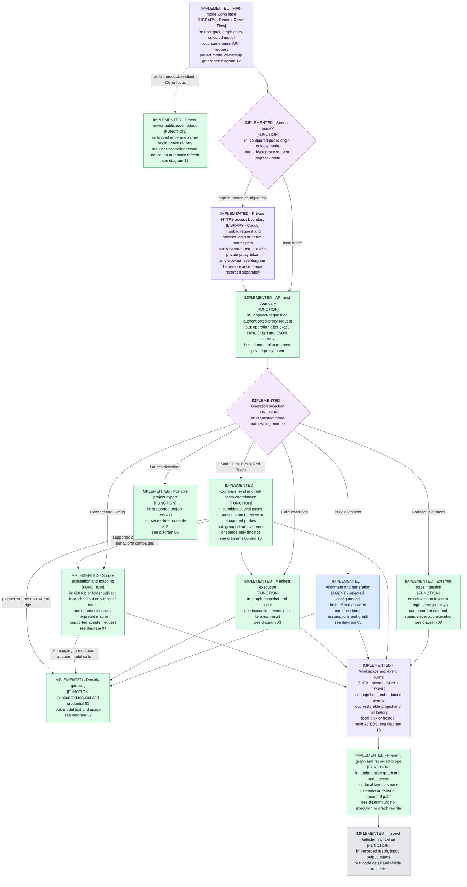

<!-- diagram: 02-credentials-providers.mmd -->

```mermaid
%% 02 IMPLEMENTED — server credentials and five provider adapters
flowchart TD
SOURCE{"Credential source<br/>[FUNCTION]<br/>in: user-selected source<br/>out: session entry or configured file import"}:::dec
SESSION["Receive key<br/>[FUNCTION]<br/>in: key and provider<br/>out: validated length and provider enum"]:::fn
FILE["Read configured local secrets file<br/>[DATA · server-only file]<br/>in: explicitly configured path<br/>out: provider-specific key match"]:::data
VAULT["Retain key in server memory<br/>[DATA · credential Map]<br/>in: provider key<br/>out: opaque ID and public metadata"]:::data
LIST["Discover account-accessible models<br/>[FUNCTION]<br/>in: credential ID<br/>out: provider model metadata"]:::fn
CAPS["Apply text adapter capability rules<br/>[FUNCTION]<br/>in: metadata and model ID<br/>out: advertised support and verified flag"]:::fn
CHECK{"Selected model available and key validated?<br/>[FUNCTION]<br/>in: config and cached catalog<br/>out: ready or explicit error"}:::dec
SCHEMA{"Optional response schema accepted?<br/>[FUNCTION]<br/>in: redacted schema object of at most 20000 serialized chars<br/>out: structured request or explicit rejection<br/>Gemini model must advertise structured support"}:::dec
ADAPT["Build fixed-endpoint provider request<br/>[FUNCTION]<br/>in: system prompt, input, token limit and optional schema<br/>out: provider-specific body<br/>Gemini schema uses responseJsonSchema and JSON MIME type;<br/>other providers use schema instructions and available JSON mode"]:::fn
SPEND{"Configured global spend guard permits call?<br/>[FUNCTION]<br/>in: known pricing and conservative token reserve<br/>out: reserve before dispatch or reject<br/>WORKBENCH_SPEND_LIMIT_USD, when configured"}:::dec
LEDGER["Record persistent spend reservation<br/>[DATA · private usage.json]<br/>in: reservation and successful reported usage<br/>out: spend carried across server restarts"]:::data
LLM["Generate model response<br/>[AGENT · config.model]<br/>in: model-specific request<br/>out: text, stop reason and reported usage"]:::agent
NORMALIZE["Normalize and redact response<br/>[FUNCTION]<br/>in: provider body<br/>out: text, usage and available cost estimate"]:::fn
RECORD["Record successful model verification<br/>[DATA · session verified-model Set]<br/>in: successful request and selected model<br/>out: verified execution label"]:::data
ERROR["Credential or provider error<br/>[FUNCTION]<br/>in: failure status<br/>out: redacted actionable message"]:::term
SOURCE -->|"session"| SESSION
SOURCE -->|"local file"| FILE
SESSION --> VAULT
FILE --> VAULT
VAULT --> LIST --> CAPS --> CHECK
CHECK -->|"yes"| SCHEMA
SCHEMA -->|"no schema or accepted contract"| ADAPT --> SPEND
SCHEMA -->|"invalid, oversized or unsupported Gemini capability"| ERROR
SPEND -->|"allowed or guard not configured"| LLM --> NORMALIZE --> RECORD
SPEND -->|"configured: reserve before call"| LEDGER
SPEND -->|"unknown rate or exhausted"| ERROR
NORMALIZE -->|"reconcile reported successful usage"| LEDGER
CHECK -->|"no"| ERROR
LLM -->|"HTTP error, empty output or truncation"| ERROR
classDef agent fill:#dbeafe,stroke:#2563eb,color:#0b2a5b;
classDef fn fill:#dcfce7,stroke:#16a34a,color:#052e16;
classDef dec fill:#f3e8ff,stroke:#9333ea,color:#2a0a4a;
classDef term fill:#e5e7eb,stroke:#6b7280,color:#111827;
classDef ask fill:#cffafe,stroke:#0891b2,color:#083344;
classDef data fill:#ede9fe,stroke:#7c3aed,color:#2a0a4a;
```

<!-- diagram: 03-manifest-runtime.mmd -->

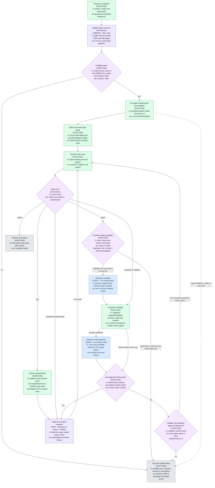

<!-- diagram: 04-imported-source.mmd -->

```mermaid
%% 04 IMPLEMENTED — source acquisition, AI interpretation and separate trusted execution
flowchart TD
SOURCE{"Repository source?<br/>[FUNCTION]<br/>in: local path, GitHub choice or uploaded folder<br/>out: source acquisition path"}:::dec
AUTH["Validate source account<br/>[FUNCTION]<br/>in: session PAT or existing local gh login<br/>out: account identity; session PAT held in memory"]:::fn
CATALOG["List accessible GitHub repositories<br/>[FUNCTION]<br/>in: validated account<br/>out: at most 100 public/private repository choices"]:::fn
URL["Validate GitHub identity<br/>[FUNCTION]<br/>in: HTTPS github.com owner/repository URL<br/>out: normalized identity; reject credentials, escapes and extra paths"]:::fn
CLONE["Acquire or reuse managed checkout<br/>[FUNCTION]<br/>in: validated identity and per-repository lock<br/>out: verified local source directory<br/>shallow clone; 90-second deadline; 2MB CLI output cap"]:::fn
ISOLATE["Enforce Git acquisition boundary<br/>[FUNCTION]<br/>in: checkout and origin/config checks<br/>out: source only; no hooks, filters, submodules or repo scripts<br/>existing checkouts preserved; atomic publication"]:::fn
LOCAL{"Host filesystem import permitted?<br/>[FUNCTION]<br/>in: user-supplied local path and serving mode<br/>out: resolve path or reject before read<br/>hosted mode forbids local-path imports"}:::dec
DENY["Reject host filesystem import<br/>[FUNCTION]<br/>in: hosted local-path request<br/>out: HTTP 403; use GitHub or folder upload"]:::term
PATH["Resolve selected local checkout<br/>[FUNCTION]<br/>in: local or managed repository path<br/>out: canonical directory"]:::fn
UPLOAD["Validate folder text upload<br/>[FUNCTION]<br/>in: portable relative paths and text<br/>out: private separate source copy plus skip counts<br/>at most 500 files, 900000 bytes each and 10 MiB total"]:::fn
FILES["Discover source resources<br/>[FUNCTION]<br/>in: repository directory<br/>out: at most 500 files, depth at most 6<br/>excludes secrets, symlinks and generated/dependency folders"]:::fn
AST["Extract bounded source evidence<br/>[LIBRARY · TypeScript AST and isolated Python ast.parse]<br/>in: at most 220 files and 12 MB source<br/>out: candidates, declared/inferred calls and source references<br/>repository code never executes"]:::data
METHOD{"Mapping mode?<br/>[FUNCTION]<br/>in: user choice and model configuration<br/>out: AI interpretation or static candidates"}:::dec
MODEL["Interpret meaningful workflow stages<br/>[AGENT · selected small config.model]<br/>in: scrubbed excerpts and candidate evidence<br/>out: at most 20 proposed workflow stages"]:::agent
VERIFY["Validate proposal coverage<br/>[FUNCTION]<br/>in: proposed nodes, references and relationships<br/>out: validated assignments; unknown candidates retained<br/>source paths/lines, unique IDs and valid edges checked"]:::fn
MAP["Retain source-owned graph<br/>[DATA · versioned graph and coverage]<br/>in: validated interpretation or static candidates<br/>out: core workflow, hidden resources and unresolved disclosure<br/>inferred structure is not observed execution"]:::data
TRUST{"Approved source and platform?<br/>[FUNCTION]<br/>in: adapter, pinned revision and current runtime platform<br/>out: upfront execution capability; map and adapter ID retained<br/>macOS sandbox-exec required; Linux execution is unavailable"}:::dec
OPAQUE["Retain non-executable source map<br/>[DATA · source references]<br/>in: unsupported host, revision or adapter<br/>out: source review and incoming traces still available<br/>known adapter ID does not grant runtime availability"]:::term
GIT["Read exact committed source<br/>[FUNCTION]<br/>in: approved revision and source allowlist<br/>out: source matching current files<br/>replacement objects disabled; inherited GIT overrides removed"]:::fn
BUNDLE["Bundle pinned overview with test shims<br/>[LIBRARY · esbuild]<br/>in: verified source, bridge, local libraries<br/>out: scratch runner without provider keys"]:::data
OS["Start reviewed-source worker<br/>[LIBRARY · macOS sandbox-exec]<br/>in: scratch bundle and request<br/>out: constrained process with original local Zod validation<br/>no network, file writes or process fork; 256MB JS heap"]:::data
SHAPE["Preserve original structured-call contract<br/>[FUNCTION]<br/>in: original pinned Zod schema and model request<br/>out: supported JSON schema plus JSON flag across IPC<br/>unsupported converter types fail closed"]:::fn
BRIDGE["Validate worker messages<br/>[FUNCTION]<br/>in: JSON lines from worker<br/>out: event or bounded provider request<br/>2MB message, 12MB total stdout, at most 6 model requests"]:::fn
SCHEMA{"Structured IPC within reviewed vocabulary and limits?<br/>[FUNCTION]<br/>in: optional schema with JSON flag and token request<br/>out: bounded gateway call or protocol rejection<br/>schema at most 20000 chars, depth 12, 80 properties/enums;<br/>anyOf at most 5; output tokens 1–3000"}:::dec
LLM["Execute mediated model call<br/>[AGENT · run.config.model]<br/>in: original prompts, preserved schema and bounded request<br/>out: response over stdin; key stays in parent<br/>Gemini native JSON Schema; other providers prompted JSON"]:::agent
ART["Render isolated overview artifact<br/>[FUNCTION]<br/>in: original schema-validated overview<br/>out: original HTML and in-memory artifact; no DB or billing"]:::fn
RESULT["Return overview result and trace<br/>[FUNCTION]<br/>in: artifact and observed invocation events<br/>out: source-linked output with ungrounded/retrieval-disabled notice"]:::term
CLEAN["Force-stop and remove scratch files<br/>[FUNCTION]<br/>in: error, cancellation or 120-second deadline<br/>out: terminated worker and preserved partial trace"]:::term
SOURCE -->|"local path"| LOCAL
LOCAL -->|"local serving mode"| PATH
LOCAL -->|"hosted serving mode"| DENY
SOURCE -->|"GitHub picker or private URL"| AUTH --> CATALOG --> URL
SOURCE -->|"folder upload"| UPLOAD --> PATH
URL --> CLONE --> ISOLATE --> PATH
PATH --> FILES --> AST --> METHOD
METHOD -->|"AI workflow map"| MODEL --> VERIFY --> MAP
METHOD -->|"static discovery; no inference"| MAP
MAP -->|"explicit supported run request only"| TRUST
TRUST -->|"unsupported or mismatched"| OPAQUE
TRUST -->|"approved overview only"| GIT --> BUNDLE --> OS --> BRIDGE
OS -->|"structured model invocation"| SHAPE --> BRIDGE
BRIDGE -->|"model request"| SCHEMA
SCHEMA -->|"valid or no schema"| LLM
SCHEMA -->|"invalid or out of bounds"| CLEAN
LLM -->|"response, never credential"| OS
BRIDGE -->|"completed original render"| ART --> RESULT
OS -.->|"timeout, cancellation, protocol error"| CLEAN
classDef agent fill:#dbeafe,stroke:#2563eb,color:#0b2a5b;
classDef fn fill:#dcfce7,stroke:#16a34a,color:#052e16;
classDef dec fill:#f3e8ff,stroke:#9333ea,color:#2a0a4a;
classDef term fill:#e5e7eb,stroke:#6b7280,color:#111827;
classDef ask fill:#cffafe,stroke:#0891b2,color:#083344;
classDef data fill:#ede9fe,stroke:#7c3aed,color:#2a0a4a;
```

<!-- diagram: 05-product-modes.mmd -->

```mermaid
%% 05 IMPLEMENTED — alignment, comparison, red-team and evaluation coordination
flowchart TD
OWNER{"Manifest-owned Build target?<br/>[FUNCTION]<br/>in: project and alignment request<br/>out: permitted planning or source-owned rejection"}:::dec
CAPTURE["Capture planning ownership<br/>[FUNCTION]<br/>in: project graph, source, brief, name and prior alignment<br/>out: state references and newest request identity"]:::fn
ALIGN["Align the requested app<br/>[AGENT · selected config.model]<br/>in: brief; one planning call, 5000 output tokens<br/>out: assumptions, questions and 1–5 proposed agents<br/>The model writes clarification questions"]:::agent
PUBLISH{"Valid proposal, newest request and unchanged project?<br/>[FUNCTION]<br/>in: generated graph and captured/current state<br/>out: publish proposal or retain newer work"}:::dec
REJECT["Reject without overwriting current state<br/>[FUNCTION]<br/>in: source-owned target, stale response or invalid identity/proposal<br/>out: actionable error; no target execution<br/>an already dispatched planning call may still incur cost"]:::term
ASK["Present open questions<br/>[FUNCTION]<br/>in: model-written questions<br/>out: user updates the brief and requests a new plan"]:::ask
APPROVE{"User accepts the proposed graph?<br/>[FUNCTION]<br/>in: explicit Accept action<br/>out: saved revision or further alignment"}:::dec
COMPARE["Prepare candidate slots<br/>[FUNCTION]<br/>in: one input, 2–5 configs, node/workflow strategy<br/>out: supported candidates with shared budget at most 30 calls"]:::fn
REDMODE{"Choose red-team capability<br/>[FUNCTION]<br/>in: imported source or executable target and selected mode<br/>out: source review or supported behavioral plan<br/>discovery-only imports default to source review"}:::dec
SOURCEPLAN["Prepare and approve source review<br/>[FUNCTION]<br/>in: protected imported source and brand criteria<br/>out: source-only suspected or inconclusive findings<br/>free plan; approved review at most 1 call, USD 0.25, 90s<br/>see diagram 10; no target execution"]:::fn
UNSUPPORTED["Explain unavailable behavioral runner<br/>[FUNCTION]<br/>in: unsupported imported execution request<br/>out: source-review option before any planner call"]:::term
RED["Produce bounded behavioral plan<br/>[AGENT · selected config.model]<br/>in: supported target, local-test or owned-staging and brand rules<br/>out: at most 6 synthetic security, brand or customer probes<br/>one planning call, 2200 output tokens"]:::agent
VALIDPROBE{"Probe shape is valid?<br/>[FUNCTION]<br/>in: selected probes within maxProbes 1–6<br/>out: persist approvable plan or reject<br/>allowed specialist, nonempty input/description, string failure signal"}:::dec
SCOPE{"User confirms the finite plan?<br/>[FUNCTION]<br/>in: confirmed=true and proposed campaign<br/>out: start once or retain proposed state"}:::dec
PIN{"Approved target still matches?<br/>[FUNCTION]<br/>in: graph/repository fingerprint and current target<br/>out: accept or require new plan<br/>historical unpinned plans reject"}:::dec
STALE["Require a new plan<br/>[FUNCTION]<br/>in: changed target or missing fingerprint<br/>out: no campaign execution"]:::term
SOURCE["Review supported source heuristics<br/>[FUNCTION]<br/>in: inspected importer rules or manifest prompts<br/>out: suspected findings, not reproduced vulnerabilities"]:::fn
SUITEOWNER{"Existing version belongs to this project?<br/>[FUNCTION]<br/>in: selected project and optional prior suite ID<br/>out: accept new/same-project lineage or reject missing/foreign ID"}:::dec
CASES["Save evaluation suite version<br/>[FUNCTION]<br/>in: verified lineage, 1–20 cases, assertions and optional judge rubric<br/>out: new immutable suite ID and incremented version"]:::fn
SCHEDULE["Execute each accepted work item<br/>[FUNCTION]<br/>in: pinned graph/repo, config/input and campaign budget at most 30<br/>out: independent run and invocation events<br/>manifest or supported source adapter"]:::fn
KIND{"Which result consumer?<br/>[FUNCTION]<br/>in: completed or partial run<br/>out: comparison, evaluation or red-team evidence"}:::dec
ASSERT["Evaluate deterministic assertions<br/>[FUNCTION]<br/>in: case output, contains/JSON/length/regex rules<br/>out: reasons; regex execution limited to 30ms"]:::fn
JUDGE["Optional rubric judgment<br/>[AGENT · suite.judge.config.model]<br/>in: rubric, expected behavior, actual output<br/>out: boolean and reason; maximum 512 output tokens"]:::agent
EVAL["Assign evaluation verdict and regression<br/>[FUNCTION]<br/>in: assertions, optional judgment and same-criteria baseline<br/>out: pass, fail, error or unscored; explicit criteria-change note"]:::fn
PROBE{"Probe has a literal failure signal?<br/>[FUNCTION]<br/>in: approved probe and completed output<br/>out: deterministic check or semantic review"}:::dec
LITERAL["Check literal failure signal<br/>[FUNCTION]<br/>in: prohibited substring and output<br/>out: reproduced or passed finding with run ID"]:::fn
REVIEW["Review semantic behavior<br/>[AGENT · selected config.model]<br/>in: expected behavior, brand rules and candidate<br/>out: suspected or passed finding; maximum 512 output tokens<br/>human confirmation required for suspected violations"]:::agent
HISTORY["Persist grouped evidence<br/>[DATA · workspace snapshots]<br/>in: comparisons, suites, reports, campaigns and run links<br/>out: retained partial and completed evidence"]:::data
PROMOTE["Draft regression case<br/>[FUNCTION]<br/>in: selected trace/finding input and run ID<br/>out: editable expectation and assertions awaiting review"]:::fn
OWNER -->|"manifest-owned"| CAPTURE --> ALIGN --> PUBLISH
OWNER -->|"source-owned; before model call"| REJECT
PUBLISH -->|"valid and current"| ASK
PUBLISH -->|"valid and current"| APPROVE
PUBLISH -->|"invalid, stale or superseded"| REJECT
ASK -.->|"answers appended to brief; new request"| OWNER
APPROVE -->|"accepted; run requested separately"| SCHEDULE
APPROVE -->|"revise"| OWNER
COMPARE --> SCHEDULE
REDMODE -->|"source review; connected repository required"| SOURCEPLAN --> HISTORY
REDMODE -->|"behavioral; manifest or supported adapter"| RED
REDMODE -->|"behavioral; unsupported import"| UNSUPPORTED
RED --> VALIDPROBE
VALIDPROBE -->|"valid"| SCOPE
VALIDPROBE -->|"invalid"| REJECT
SCOPE -->|"confirmed"| PIN
PIN -->|"same approved target"| SOURCE --> SCHEDULE
PIN -->|"changed or unpinned"| STALE
SCOPE -->|"not confirmed"| RED
SUITEOWNER -->|"no prior ID or same-project version"| CASES --> SCHEDULE --> KIND
SUITEOWNER -->|"missing or foreign prior ID"| REJECT
KIND -->|"comparison: retain each candidate"| HISTORY
KIND -->|"eval: successful execution"| ASSERT
KIND -->|"red team: successful execution"| PROBE
KIND -->|"failed/cancelled: error or inconclusive"| HISTORY
ASSERT -->|"judge configured"| JUDGE --> EVAL
ASSERT -->|"deterministic only"| EVAL --> HISTORY
PROBE -->|"yes"| LITERAL --> HISTORY
PROBE -->|"no"| REVIEW --> HISTORY
HISTORY --> PROMOTE --> SUITEOWNER
classDef agent fill:#dbeafe,stroke:#2563eb,color:#0b2a5b;
classDef fn fill:#dcfce7,stroke:#16a34a,color:#052e16;
classDef dec fill:#f3e8ff,stroke:#9333ea,color:#2a0a4a;
classDef term fill:#e5e7eb,stroke:#6b7280,color:#111827;
classDef ask fill:#cffafe,stroke:#0891b2,color:#083344;
classDef data fill:#ede9fe,stroke:#7c3aed,color:#2a0a4a;
```

<!-- diagram: 06-export-hosting.mmd -->

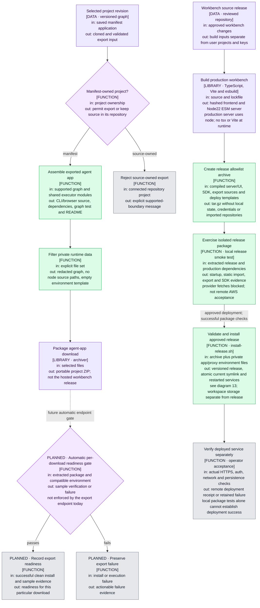

<!-- diagram: 07-custom-code-sandbox.mmd -->

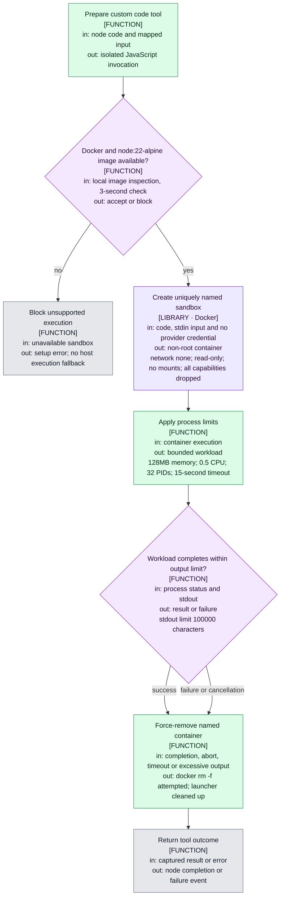

<!-- diagram: 08-external-observation.mmd -->

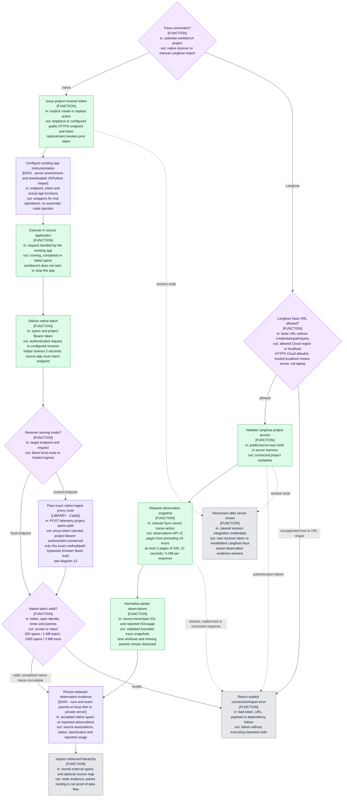

<!-- diagram: 09-graph-presentation.mmd -->

```mermaid
%% 09 IMPLEMENTED — presentation only; final browser acceptance remains a separate QA gate
flowchart TD
VIEW{"Selected graph view?<br/>[FUNCTION]<br/>in: draft/source selection or recorded run<br/>out: authoritative graph snapshot"}:::dec
DRAFT["Read application graph<br/>[DATA · current graph revision]<br/>in: selected project<br/>out: editable manifest or source-owned map"]:::data
RUN["Read immutable run graph<br/>[DATA · recorded run and node events]<br/>in: selected run ID<br/>out: saved source context and actual invocation evidence"]:::data
SCOPE{"External trace in Recorded path mode?<br/>[FUNCTION]<br/>in: external-run flag and path/context selection<br/>out: evidence projection or full context"}:::dec
PATH["Project recorded activity<br/>[FUNCTION]<br/>in: graph nodes referenced by real node events<br/>out: independent display graph and original observed edges<br/>no invented nodes, links or chronology"]:::fn
LAYOUT["Lay out visible relationships<br/>[FUNCTION]<br/>in: graph snapshot and card dimensions<br/>out: stable cycle/component coordinates and routing hints<br/>default at most 4 peer rows; original graph unchanged"]:::fn
DETAIL{"Imported source overview?<br/>[FUNCTION]<br/>in: graph ownership, view and detail choice<br/>out: reduced source view or complete visible edge set"}:::dec
PRIMARY["Select source overview relationships<br/>[FUNCTION]<br/>in: original source edges and connected overview IDs<br/>out: existing primary relationships plus every explicit feedback edge"]:::fn
ALL["Retain complete visible relationships<br/>[FUNCTION]<br/>in: original edges for the chosen graph scope<br/>out: every visible edge ID, instruction and provenance<br/>parallel and feedback contracts retained"]:::fn
CANVAS["Render graph exploration<br/>[LIBRARY · React Flow]<br/>in: presentation nodes, original edges and real node states<br/>out: overview/all, Fit, Focus, node jump and optional labels"]:::data
FULL["Apply temporary viewport controls<br/>[FUNCTION]<br/>in: fullscreen, inspector and keyboard actions<br/>out: expanded canvas or restored workspace<br/>nested modals retain focus priority"]:::fn
SELECT["Resolve canonical selection<br/>[FUNCTION]<br/>in: selected original node or edge ID<br/>out: source details or recorded invocation evidence"]:::fn
EDIT{"Editable manifest draft?<br/>[FUNCTION]<br/>in: graph ownership and current/historical view<br/>out: permitted edit or read-only inspector"}:::dec
SAVE["Update explicit draft configuration<br/>[FUNCTION]<br/>in: user prompt, schema, code or connection edit<br/>out: changed draft; normal save creates next revision"]:::term
INSPECT["Inspect preserved evidence<br/>[FUNCTION]<br/>in: original source references or run events<br/>out: read-only source, input, output, status and invocation<br/>layout rank is not execution order or parallelism"]:::term
VIEW -->|"current design"| DRAFT --> LAYOUT
VIEW -->|"recorded execution"| RUN --> SCOPE
SCOPE -->|"external trace and Recorded path"| PATH --> LAYOUT
SCOPE -->|"manifest run or Full source context"| LAYOUT
LAYOUT --> DETAIL
DETAIL -->|"yes; unobserved source overview only"| PRIMARY --> CANVAS
DETAIL -->|"All connections, manifest or recorded scope"| ALL --> CANVAS
CANVAS --> FULL
CANVAS --> SELECT --> EDIT
EDIT -->|"yes; explicit edit only"| SAVE
EDIT -->|"source-owned or historical"| INSPECT
classDef agent fill:#dbeafe,stroke:#2563eb,color:#0b2a5b;
classDef fn fill:#dcfce7,stroke:#16a34a,color:#052e16;
classDef dec fill:#f3e8ff,stroke:#9333ea,color:#2a0a4a;
classDef term fill:#e5e7eb,stroke:#6b7280,color:#111827;
classDef ask fill:#cffafe,stroke:#0891b2,color:#083344;
classDef data fill:#ede9fe,stroke:#7c3aed,color:#2a0a4a;
```

<!-- diagram: 10-source-review.mmd -->

```mermaid
%% 10 IMPLEMENTED — free source plan and approved bounded review; no target execution
flowchart TD
INPUT["Prepare imported-source review<br/>[FUNCTION]<br/>in: connected repository or uploaded folder, graph and brand criteria<br/>out: deterministic evidence request; no key or model call"]:::fn
READ["Collect protected source evidence<br/>[FUNCTION]<br/>in: safe discovered inventory and source references<br/>out: scrubbed numbered excerpts and whole selected-file hashes<br/>max 30 files, 60000 chars, 8000 per file, 1200 per line"]:::fn
PRESENT{"Usable source and unchanged target?<br/>[FUNCTION]<br/>in: evidence and current graph/repo identity<br/>out: free plan or explicit preparation error"}:::dec
PLAN["Persist proposed source plan<br/>[DATA · RedPlan review metadata]<br/>in: graph/repo fingerprint, evidence digest, ranges and counts<br/>out: inspectable coverage, zero probes and maxCalls 1<br/>no unredacted source stored in metadata"]:::data
APPROVE{"User explicitly approves model review?<br/>[FUNCTION]<br/>in: confirmed=true and compatible credential/model<br/>out: ready request or retained proposed plan"}:::dec
PENDING["Retain free proposed plan<br/>[FUNCTION]<br/>in: no approval or no validated model<br/>out: configure model or review coverage first"]:::ask
RECHECK["Lock start and recollect evidence<br/>[FUNCTION]<br/>in: proposed plan and current source<br/>out: target fingerprint and evidence digest comparison<br/>completed or concurrent starts reject"]:::fn
PIN{"Approved graph and evidence still match?<br/>[FUNCTION]<br/>in: current target, original-byte hashes and inventory<br/>out: start once or require replanning<br/>historical unpinned plans reject before inference"}:::dec
ERROR["Reject without a model call<br/>[FUNCTION]<br/>in: absent source, stale plan, missing key or duplicate start<br/>out: actionable error; no target run"]:::term
BUDGET["Reserve bounded review call<br/>[FUNCTION]<br/>in: approved model, known pricing and global guard<br/>out: at most 1 call, USD 0.25 reserve and 90s deadline<br/>maximum 4096 output tokens; no tools"]:::fn
MODEL["Review supplied source hypotheses<br/>[AGENT · selected config.model]<br/>in: scrubbed excerpts and brand criteria as untrusted evidence<br/>out: strict JSON; at most 12 proposed findings"]:::agent
SCHEMA{"Reviewer response matches strict schema?<br/>[LIBRARY · Zod]<br/>in: at most 60000 response characters and known fields<br/>out: citation checks or inconclusive result"}:::dec
CITE["Validate every source citation<br/>[FUNCTION]<br/>in: supplied path, positive line and quote at most 500 chars<br/>out: accepted or rejected evidence<br/>quote starts on cited line; no missing/clipped-line bridges"]:::fn
KEEP["Retain source-backed hypotheses<br/>[DATA · suspected findings]<br/>in: accepted citations, safe quote and recommendation<br/>out: suspected only; no reproduced or passed verdict"]:::data
INCONCLUSIVE["Retain uncertainty and failure evidence<br/>[DATA · review notes and inconclusive findings]<br/>in: rejected citations, malformed response, timeout or provider error<br/>out: rejected counts or incomplete-review reason"]:::data
RESULT["Inspect bounded review result<br/>[FUNCTION]<br/>in: coverage, model usage, hypotheses and uncertainty<br/>out: saved safe quotation and current-checkout source preview<br/>no target execution; no security clearance"]:::term
INPUT --> READ --> PRESENT
PRESENT -->|"source available; same target"| PLAN --> APPROVE
PRESENT -->|"empty or changed"| ERROR
APPROVE -->|"not ready"| PENDING
APPROVE -->|"explicitly confirmed and model ready"| RECHECK --> PIN
RECHECK -->|"duplicate or no longer proposed"| ERROR
PIN -->|"matches"| BUDGET --> MODEL --> SCHEMA
PIN -->|"changed or unpinned"| ERROR
BUDGET -->|"unknown pricing or insufficient allowance"| INCONCLUSIVE
MODEL -->|"failure or deadline"| INCONCLUSIVE
SCHEMA -->|"valid"| CITE
SCHEMA -->|"invalid"| INCONCLUSIVE
CITE -->|"exact supplied evidence"| KEEP --> RESULT
CITE -->|"unsupported or duplicate citation"| INCONCLUSIVE --> RESULT
classDef agent fill:#dbeafe,stroke:#2563eb,color:#0b2a5b;
classDef fn fill:#dcfce7,stroke:#16a34a,color:#052e16;
classDef dec fill:#f3e8ff,stroke:#9333ea,color:#2a0a4a;
classDef term fill:#e5e7eb,stroke:#6b7280,color:#111827;
classDef ask fill:#cffafe,stroke:#0891b2,color:#083344;
classDef data fill:#ede9fe,stroke:#7c3aed,color:#2a0a4a;
```

<!-- diagram: 11-client-version.mmd -->

```mermaid
%% 11 IMPLEMENTED — detect a newer production client without discarding work
flowchart TD
MODE{"Explicit development mode enabled?<br/>[FUNCTION]<br/>in: WORKBENCH_DEV captured at startup<br/>out: Vite only for value 1, otherwise production"}:::dec
DEV["Start requested development server<br/>[LIBRARY · Vite middleware]<br/>in: WORKBENCH_DEV=1 from npm run dev<br/>out: development client; no production-entry comparison"]:::term
BUILD{"Production build exists before listen?<br/>[FUNCTION]<br/>in: dist/index.html at startup<br/>out: serve production or fail without a listener"}:::dec
MISSING["Reject missing production build<br/>[FUNCTION]<br/>in: absent dist/index.html<br/>out: explicit npm run build instructions; no Vite fallback"]:::term
HTML["Serve the published interface<br/>[FUNCTION]<br/>in: current dist HTML and hashed assets<br/>out: static response with Cache-Control no-store"]:::fn
LOAD["Capture loaded module identity<br/>[FUNCTION]<br/>in: current page module-script source<br/>out: loaded entry path"]:::fn
PROD{"Loaded path starts with /assets/?<br/>[FUNCTION]<br/>in: loaded entry path<br/>out: production check or no comparison"}:::dec
SKIP["Keep current development client<br/>[FUNCTION]<br/>in: no production entry path<br/>out: no release-comparison timer"]:::term
TRIGGER["Schedule visible-client checks<br/>[FUNCTION]<br/>in: initial load, focus, visibility event or 30000ms interval<br/>out: health request while document is visible"]:::fn
HEALTH["Read current published entry<br/>[FUNCTION]<br/>in: local health request and current dist/index.html<br/>out: uiEntry path or null<br/>entry is reread on each request"]:::fn
MATCH{"Published entry differs from loaded entry?<br/>[FUNCTION]<br/>in: non-null uiEntry and loaded path<br/>out: update banner or unchanged client"}:::dec
KEEP["Continue existing client<br/>[FUNCTION]<br/>in: same entry, missing entry or unreachable check<br/>out: no automatic reload"]:::term
BANNER["Present update notice<br/>[FUNCTION]<br/>in: different published entry and draft state<br/>out: reload option with explicit unsaved-work warning<br/>message is fixed UI text, not model-written"]:::ask
DIRTY{"Unsaved graph changes?<br/>[FUNCTION]<br/>in: current dirty graph flag<br/>out: disabled reload or user-controlled action"}:::dec
SAVE["Wait for graph save<br/>[FUNCTION]<br/>in: dirty graph and visible update notice<br/>out: existing work retained; reload disabled"]:::ask
RELOAD["Reload on explicit user action<br/>[FUNCTION]<br/>in: user clicks Reload app; other unsaved forms were warned about<br/>out: request current published interface"]:::fn
MODE -->|"value 1"| DEV
MODE -->|"any other value"| BUILD
BUILD -->|"exists"| HTML --> LOAD --> PROD
BUILD -->|"missing"| MISSING
PROD -->|"production entry"| TRIGGER --> HEALTH --> MATCH
PROD -->|"development or no module path"| SKIP
HEALTH -->|"request fails or no entry"| KEEP
MATCH -->|"different entry"| BANNER --> DIRTY
MATCH -->|"same entry"| KEEP
DIRTY -->|"yes"| SAVE
DIRTY -->|"no; user chooses reload"| RELOAD --> HTML
SAVE -.->|"user saves graph"| DIRTY
KEEP -.->|"next visible-client check"| TRIGGER
classDef agent fill:#dbeafe,stroke:#2563eb,color:#0b2a5b;
classDef fn fill:#dcfce7,stroke:#16a34a,color:#052e16;
classDef dec fill:#f3e8ff,stroke:#9333ea,color:#2a0a4a;
classDef term fill:#e5e7eb,stroke:#6b7280,color:#111827;
classDef ask fill:#cffafe,stroke:#0891b2,color:#083344;
classDef data fill:#ede9fe,stroke:#7c3aed,color:#2a0a4a;
```

<!-- diagram: 12-ui-ownership.mmd -->

```mermaid
%% 12 IMPLEMENTED in inspected source — project/model ownership; post-fix browser gate is separate
flowchart TD
SWITCH{"Foreground mutation active?<br/>[FUNCTION]<br/>in: requested project/new/navigation action and busy state<br/>out: wait or permit selection change"}:::dec
WAIT["Retain mutation context<br/>[FUNCTION]<br/>in: active foreground operation<br/>out: project/new/navigation, presets and graph editors disabled<br/>central graph-update/connection guard rejects edits;<br/>temporary lock is separate from read-only ownership"]:::term
RESET["Reset project-specific drafts<br/>[FUNCTION]<br/>in: resolved new project identity<br/>out: fresh eval, input, slot, baseline, brand and view selections"]:::fn
HISTORY["Resolve selected history within project<br/>[FUNCTION]<br/>in: selected IDs and current project ID<br/>out: matching run, comparison, campaign or report; no foreign result"]:::fn
VIEW["Render the selected workspace<br/>[LIBRARY · React]<br/>in: project drafts and owned immutable evidence<br/>out: current-project forms and inspectors<br/>comparison effects set graph view only on Graph Results"]:::data
SELECT["Select a workbench credential<br/>[FUNCTION]<br/>in: user-selected credential ID<br/>out: cleared model selection and catalog request"]:::fn
CATALOG["Cache returned model catalog<br/>[FUNCTION]<br/>in: response and original request credential ID<br/>out: catalog under that credential, independent of current choice"]:::fn
DEFAULT["Resolve model defaults from current selection<br/>[FUNCTION]<br/>in: current credential and its cached model list<br/>out: compatible default only where selection is empty<br/>late response cannot choose another credential's model"]:::fn
REFRESH["Reconcile server credential metadata<br/>[FUNCTION]<br/>in: refreshed valid credential IDs and browser references<br/>out: stale current/slot credentials and catalogs removed"]:::fn
READY{"Current credential and selected model ready?<br/>[FUNCTION]<br/>in: valid server key ID and current cached model<br/>out: allowed action or configuration recovery<br/>model must be available and text-capable"}:::dec
CONFIG["Ask for a valid model configuration<br/>[FUNCTION]<br/>in: invalid/missing key or incompatible model<br/>out: fixed configuration message and credential dialog"]:::ask
REQUEST["Dispatch the selected action<br/>[FUNCTION]<br/>in: current project plus verified selection<br/>out: bounded API request; server independently validates"]:::term
SWITCH -->|"busy"| WAIT
SWITCH -->|"not busy; new project resolved"| RESET --> HISTORY --> VIEW
SELECT --> CATALOG --> DEFAULT --> READY
REFRESH --> DEFAULT
VIEW -->|"user requests model-backed action"| READY
READY -->|"validated key and compatible listed model"| REQUEST
READY -->|"not ready"| CONFIG
CONFIG -.->|"user configures credential"| SELECT
classDef agent fill:#dbeafe,stroke:#2563eb,color:#0b2a5b;
classDef fn fill:#dcfce7,stroke:#16a34a,color:#052e16;
classDef dec fill:#f3e8ff,stroke:#9333ea,color:#2a0a4a;
classDef term fill:#e5e7eb,stroke:#6b7280,color:#111827;
classDef ask fill:#cffafe,stroke:#0891b2,color:#083344;
classDef data fill:#ede9fe,stroke:#7c3aed,color:#2a0a4a;
```

<!-- diagram: 13-private-hosting.mmd -->

```mermaid
%% 13 IMPLEMENTED private hosting boundary — deployment verification recorded separately
flowchart TD
ENV{"Hosted configuration valid?<br/>[FUNCTION · startup and installer]<br/>in: app and proxy environment files<br/>out: enabled hosted mode or startup failure<br/>exact HTTPS origin; matching random proxy token 32–512 chars;<br/>production build required; no dev serving"}:::dec
NODE["Start one-owner workbench service<br/>[LIBRARY · Node22 and systemd]<br/>in: compiled release plus private environment<br/>out: unprivileged process listening only on 127.0.0.1:3001<br/>read-only system/home; private temp; 768MiB service memory"]:::data
REQUEST["Request private workbench<br/>[DATA · browser or instrumented app]<br/>in: public HTTPS URL and relevant credential<br/>out: remote request; deployment archive excludes local keys and state"]:::data
NETWORK["Apply AWS network boundary<br/>[LIBRARY · EC2 security group]<br/>in: public traffic to one Linux instance<br/>out: 80 for ACME/redirect and 443 for HTTPS<br/>no ingress on 22 or 3001; management uses SSM"]:::data
TLS["Terminate HTTPS<br/>[LIBRARY · Caddy]<br/>in: configured public hostname and request<br/>out: encrypted-transport request at proxy<br/>certificate and reachability require remote verification"]:::data
ROUTE{"Exact native ingest request?<br/>[FUNCTION · Caddy matcher]<br/>in: HTTP method and path<br/>out: scoped ingestion lane or browser authentication<br/>POST /api/telemetry/project-id/spans only"}:::dec
AUTH{"Owner browser credentials valid?<br/>[LIBRARY · Caddy basic_auth]<br/>in: Basic authorization over TLS and bcrypt hash<br/>out: accepted request or HTTP 401"}:::dec
WEB["Forward authenticated browser request<br/>[LIBRARY · Caddy reverse_proxy]<br/>in: accepted owner request<br/>out: original public Host/Origin and injected proxy token<br/>Basic Authorization stripped before Node"]:::data
INGEST["Forward native request<br/>[LIBRARY · Caddy reverse_proxy]<br/>in: exact ingestion method/path<br/>out: injected proxy token and preserved project Bearer token<br/>browser password is not shared with instrumented apps"]:::data
TRUST{"App trust boundary valid?<br/>[FUNCTION · hosting.ts and API middleware]<br/>in: proxy token, Host, Origin and Fetch Site<br/>out: dispatch or HTTP 403<br/>token digest constant-time compare; exact configured Host;<br/>Origin absent or exact; cross-site denied; forwarded Host ignored"}:::dec
OP{"Application operation?<br/>[FUNCTION · API routing]<br/>in: accepted request and JSON body where required<br/>out: source/run operation or native-ingest validation"}:::dec
BEARER{"Project telemetry token valid?<br/>[FUNCTION · authorizeReceiver]<br/>in: issued token for this project<br/>out: accepted bounded spans or HTTP 401<br/>proxy secret alone does not authorize native ingestion"}:::dec
CAP["Enforce hosted capability boundary<br/>[FUNCTION · API, importer and preflight]<br/>in: requested operation and current platform<br/>out: GitHub/upload, manifest workflow, source review or observation<br/>host-path and local-key imports disabled; Linux source runner gated"]:::fn
VAULT["Hold session model and integration keys<br/>[DATA · server process memory]<br/>in: authenticated configuration<br/>out: scoped calls; values absent from release and browser state<br/>restart requires keys and native token to be re-added"]:::data
STORE["Write private workspace evidence<br/>[DATA · JSON snapshots, JSONL events and managed source]<br/>in: saved work and redacted run evidence<br/>out: /var/lib/agent-workbench; separate from versioned releases"]:::data
VOLUME["Retain encrypted workspace disk<br/>[LIBRARY · AWS EBS gp3]<br/>in: separate 8GiB workspace volume and verified mount<br/>out: retained data across instance replacement or stack deletion<br/>DeletionPolicy and UpdateReplacePolicy Retain;<br/>root disk is separate and disposable"]:::data
RESTART["Recover after service restart<br/>[FUNCTION · store recovery]<br/>in: saved workspace and incomplete runs<br/>out: reopened projects and explicit interrupted evidence<br/>no automatic side-effect replay; credentials remain absent"]:::fn
RECEIPT["Verify instance and storage acceptance<br/>[FUNCTION · operator deployment checks]<br/>in: actual TLS/auth/network tests and workspace mount inspection<br/>out: deployment receipt or failure; not implied by source templates<br/>retained volume still needs recovery and backup operations"]:::term
DENY["Reject at the failing boundary<br/>[FUNCTION]<br/>in: invalid setup, credentials, origin, method or unsupported operation<br/>out: startup failure or explicit HTTP error; no model dispatch"]:::term
ENV -->|"valid"| NODE
ENV -->|"invalid"| DENY
REQUEST --> NETWORK --> TLS --> ROUTE
ROUTE -->|"exact native POST path"| INGEST
ROUTE -->|"every other request"| AUTH
AUTH -->|"valid owner credentials"| WEB
AUTH -->|"invalid or missing"| DENY
WEB --> TRUST
INGEST --> TRUST
NODE -.->|"loopback listener; no public app port"| TRUST
TRUST -->|"accepted"| OP
TRUST -->|"invalid"| DENY
OP -->|"native spans"| BEARER
BEARER -->|"valid token and payload"| STORE
BEARER -->|"invalid or missing token"| DENY
OP -->|"ordinary authenticated API operation"| CAP
CAP -->|"allowed saved work and results"| STORE
CAP -->|"model/integration setup"| VAULT
CAP -->|"host path, secret import or unsupported runner"| DENY
STORE --> VOLUME
VOLUME -->|"same verified mounted workspace"| RESTART
RESTART --> NODE
NODE -.-> RECEIPT
VOLUME -.-> RECEIPT
classDef agent fill:#dbeafe,stroke:#2563eb,color:#0b2a5b;
classDef fn fill:#dcfce7,stroke:#16a34a,color:#052e16;
classDef dec fill:#f3e8ff,stroke:#9333ea,color:#2a0a4a;
classDef term fill:#e5e7eb,stroke:#6b7280,color:#111827;
classDef ask fill:#cffafe,stroke:#0891b2,color:#083344;
classDef data fill:#ede9fe,stroke:#7c3aed,color:#2a0a4a;
```

## Regeneration and validation

After editing these Mermaid fences, mirror each block into its named `.mmd` file. Then run:

```bash
node /Users/macbook/.agents/skills/power-coding/scripts/validate-mmd.mjs docs/mermaid
node /Users/macbook/.agents/skills/power-coding/scripts/build-html.mjs docs/mermaid docs/architecture-flow.html
```

The original seven-diagram snapshot passed parsing and browser rendering; the later twelve-diagram source/client snapshot passed the real Mermaid parser. The private-hosting update changes diagrams 01/04/06/08 and adds diagram 13. **All 13 diagrams pass the real Mermaid parser**, their canonical Markdown fences match the `.mmd` files, and the standalone viewer was regenerated using the skill scripts. Existing local parser dependencies were reused; no cloud, provider or browser call was made. A successful parse does not establish remote deployment acceptance or visual readability. The viewer is a standalone documentation artifact, not a runtime debug tab.

## Known boundaries

- Metadata discovery is not proof of model inference compatibility; verified execution is a separate flag.
- Phrase and schema checks cannot establish factual accuracy. Optional model judges remain fallible.
- Local filesystem permissions and hosted encrypted EBS protect different boundaries. The hosted preview still has one owner workspace; it is not per-tenant encrypted storage or multi-user authorization.
- Candidate inventory, parsed files and model excerpts are bounded. Valid source references do not prove the model grouped every responsibility correctly. Hidden resources and unresolved coverage remain inspectable.
- Native tracing covers only instrumented operations and requires receiver reachability plus a per-project token. The exact hosted POST exception bypasses only browser login, not receiver authorization. Manual Langfuse snapshots may omit parents or older spans; imported observations never execute the source application.
- Source overview, external Recorded path and Full source context are display scopes, not different stored applications. A missing path edge means no matching observed relationship was recorded; the UI must not invent one from node timing or source proximity.
- The trusted imported overview disables retrieval and external persistence; full lesson generation remains discovery-only. Its macOS policy permits scoped read access plus root-directory metadata needed by the loader; network, file writes and child-process creation are denied. It is a reviewed-source adapter, not a general hostile-code sandbox.
- Source review is a bounded selected-model inspection of source, never target execution. Exact citations establish where quoted text came from, not that the risk is exploitable or that omitted code is safe. Whole selected-file hashes detect changes beyond supplied excerpts; unselected-file content is outside that guarantee. Behavioral specialists remain labelled probe concerns, not separate autonomous agents, and retain their adapter gate.
- Export assembly and a clean-directory CLI sample are verified for the support app. The browser wrapper has free HTTP-boundary and abort-survival coverage; interactive model-backed browser acceptance is separate. The download endpoint does not automatically enforce a readiness gate for each download.
- Private single-owner hosting code, production packaging and infrastructure templates are implemented. Actual remote provisioning/TLS/authentication/storage acceptance belongs to the deployment receipt; these diagrams do not assert it has passed. Tenant identity, multi-user authorization and a generic remote source runner remain unbuilt. Retained EBS is not a backup or an automatic recovery mechanism. See [AWS-READINESS.md](AWS-READINESS.md).
- Decisions and rejected alternatives are in [DECISIONS.md](DECISIONS.md).
