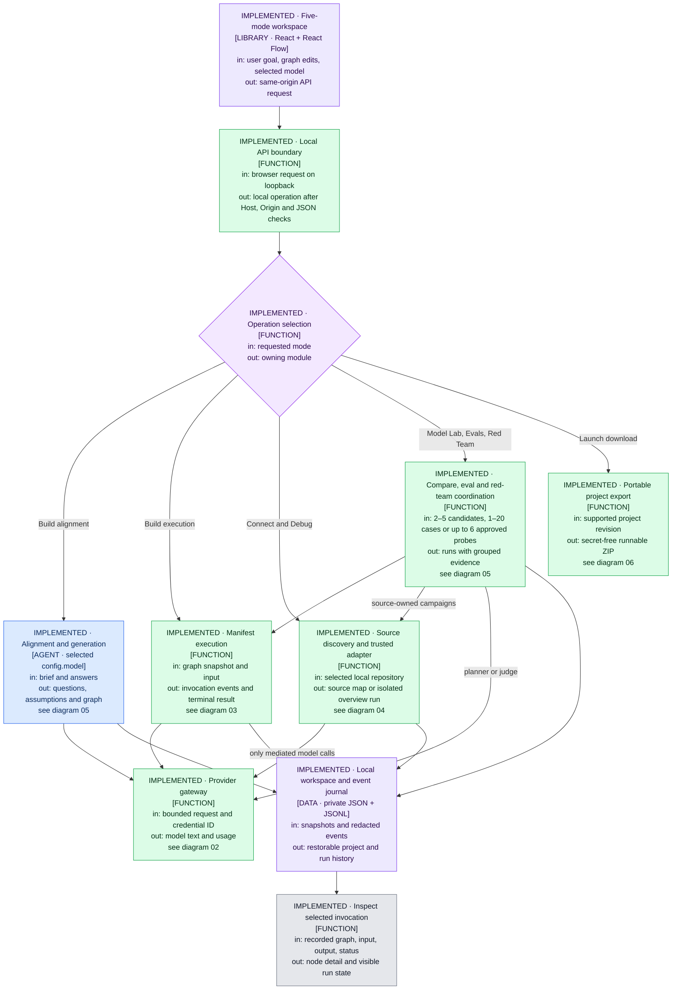
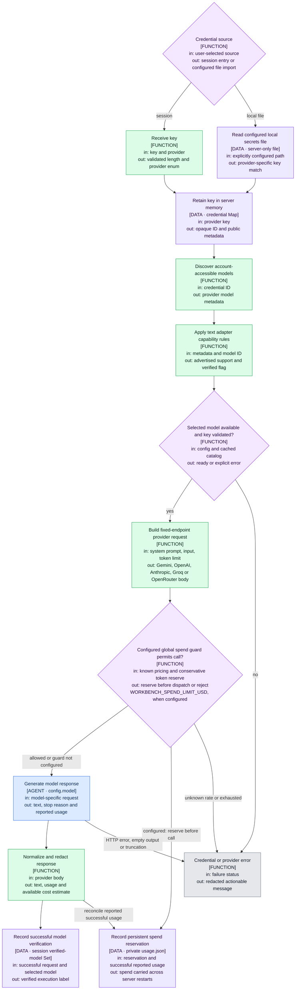
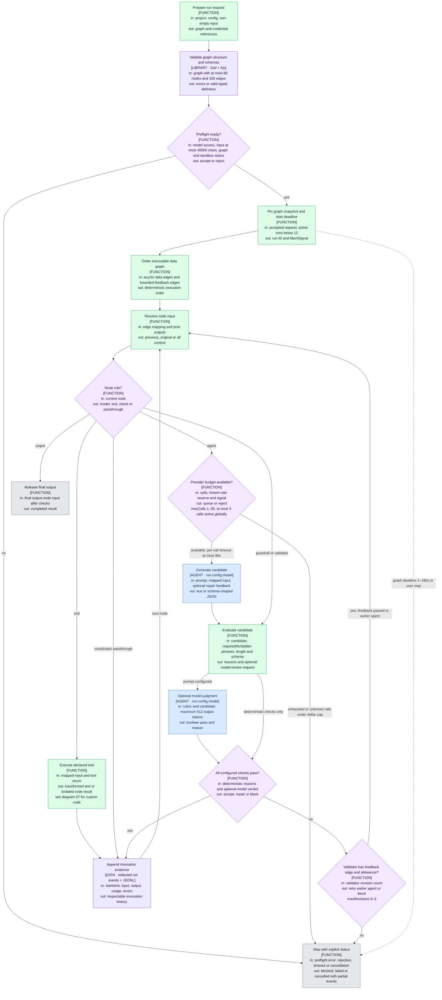
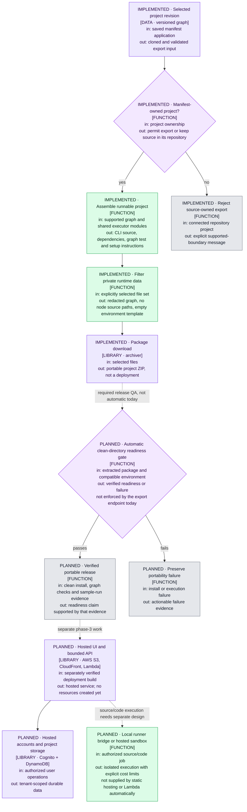
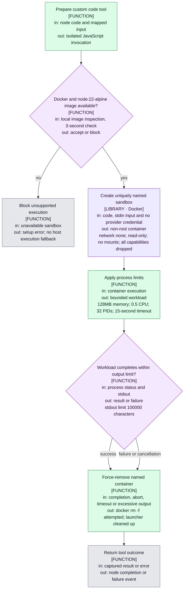

```mermaid
%% 04 IMPLEMENTED — source map and narrowly trusted Learning Studio execution
flowchart TD
SOURCE{"Repository source?<br/>[FUNCTION]<br/>in: local path, GitHub URL or picker choice<br/>out: local discovery or managed acquisition"}:::dec
CATALOG["List GitHub repositories<br/>[FUNCTION]<br/>in: existing authenticated gh login<br/>out: at most 100 account repositories; 30-second deadline"]:::fn
URL["Validate GitHub identity<br/>[FUNCTION]<br/>in: HTTPS github.com owner/repository URL<br/>out: normalized identity; reject credentials, escapes and extra paths"]:::fn
CLONE["Acquire or reuse managed checkout<br/>[FUNCTION]<br/>in: validated identity and per-repository lock<br/>out: verified local source directory<br/>shallow clone; 90-second deadline; 2MB CLI output cap"]:::fn
ISOLATE["Enforce Git acquisition boundary<br/>[FUNCTION]<br/>in: checkout and origin/config checks<br/>out: source only; no hooks, filters, submodules or repo scripts<br/>existing checkouts preserved; atomic publication"]:::fn
PATH["Resolve selected local checkout<br/>[FUNCTION]<br/>in: local or managed repository path<br/>out: canonical directory"]:::fn
FILES["Discover source resources<br/>[FUNCTION]<br/>in: repository directory<br/>out: at most 500 files, depth at most 6<br/>excludes secrets, symlinks and generated/dependency folders"]:::fn
MAP["Build source-linked graph<br/>[FUNCTION]<br/>in: recognized paths and symbols<br/>out: workflow nodes plus collapsed UI, DB/auth and Markdown"]:::fn
TRUST{"Approved source and platform?<br/>[FUNCTION]<br/>in: adapter, pinned revision and 14 allowlisted files<br/>out: isolated execution or discovery only<br/>macOS sandbox-exec required"}:::dec
OPAQUE["Retain discovery-only map<br/>[DATA · source references]<br/>in: unsupported or changed source<br/>out: coverage and opaque components; no execution"]:::term
GIT["Read exact committed source<br/>[FUNCTION]<br/>in: approved revision and source allowlist<br/>out: source matching current files<br/>replacement objects disabled; inherited GIT overrides removed"]:::fn
BUNDLE["Bundle pinned overview with test shims<br/>[LIBRARY · esbuild]<br/>in: verified source, bridge, local libraries<br/>out: scratch runner without provider keys"]:::data
OS["Start reviewed-source worker<br/>[LIBRARY · macOS sandbox-exec]<br/>in: scratch bundle and request<br/>out: constrained process<br/>no network, file writes or process fork; 256MB JS heap"]:::data
BRIDGE["Validate worker messages<br/>[FUNCTION]<br/>in: JSON lines from worker<br/>out: event or bounded provider request<br/>2MB message, 12MB total stdout, at most 6 model requests"]:::fn
LLM["Execute mediated model call<br/>[AGENT · run.config.model]<br/>in: original source prompts and bounded request<br/>out: response returned over stdin; key stays in parent"]:::agent
ART["Render isolated overview artifact<br/>[FUNCTION]<br/>in: original schema-validated overview<br/>out: original HTML and in-memory artifact; no DB or billing"]:::fn
RESULT["Return overview result and trace<br/>[FUNCTION]<br/>in: artifact and observed invocation events<br/>out: source-linked output with ungrounded/retrieval-disabled notice"]:::term
CLEAN["Force-stop and remove scratch files<br/>[FUNCTION]<br/>in: error, cancellation or 120-second deadline<br/>out: terminated worker and preserved partial trace"]:::term
SOURCE -->|"local path"| PATH
SOURCE -->|"GitHub picker"| CATALOG --> URL
SOURCE -->|"GitHub URL"| URL
URL --> CLONE --> ISOLATE --> PATH
PATH --> FILES --> MAP --> TRUST
TRUST -->|"unsupported or mismatched"| OPAQUE
TRUST -->|"approved overview only"| GIT --> BUNDLE --> OS --> BRIDGE
BRIDGE -->|"model request"| LLM
LLM -->|"response, never credential"| OS
BRIDGE -->|"completed original render"| ART --> RESULT
OS -.->|"timeout, cancellation, protocol error"| CLEAN
classDef agent fill:#dbeafe,stroke:#2563eb,color:#0b2a5b;
classDef fn fill:#dcfce7,stroke:#16a34a,color:#052e16;
classDef dec fill:#f3e8ff,stroke:#9333ea,color:#2a0a4a;
classDef term fill:#e5e7eb,stroke:#6b7280,color:#111827;
classDef ask fill:#cffafe,stroke:#0891b2,color:#083344;
classDef data fill:#ede9fe,stroke:#7c3aed,color:#2a0a4a;
```

```mermaid
%% 05 IMPLEMENTED — alignment, comparison, red-team and evaluation coordination
flowchart TD
ALIGN["Align the requested app<br/>[AGENT · selected config.model]<br/>in: brief; one planning call, 5000 output tokens<br/>out: assumptions, questions and 1–5 proposed agents<br/>The model writes clarification questions"]:::agent
ASK["Present open questions<br/>[FUNCTION]<br/>in: model-written questions<br/>out: user updates the brief and requests a new plan"]:::ask
APPROVE{"User accepts the proposed graph?<br/>[FUNCTION]<br/>in: explicit Accept action<br/>out: saved revision or further alignment"}:::dec
COMPARE["Prepare candidate slots<br/>[FUNCTION]<br/>in: one input, 2–5 configs, node/workflow strategy<br/>out: supported candidates with shared budget at most 30 calls"]:::fn
RED["Produce bounded probe plan<br/>[AGENT · selected config.model]<br/>in: local-test or owned-staging declaration and brand rules<br/>out: at most 6 synthetic security, brand or customer probes<br/>one planning call, 2200 output tokens"]:::agent
SCOPE{"User confirms the finite plan?<br/>[FUNCTION]<br/>in: confirmed=true and proposed campaign<br/>out: start once or retain proposed state"}:::dec
SOURCE["Review supported source heuristics<br/>[FUNCTION]<br/>in: inspected importer rules or manifest prompts<br/>out: suspected findings, not reproduced vulnerabilities"]:::fn
CASES["Save evaluation suite version<br/>[FUNCTION]<br/>in: 1–20 cases, assertions and optional judge rubric<br/>out: immutable suite version and report with pinned criteria"]:::fn
SCHEDULE["Execute each accepted work item<br/>[FUNCTION]<br/>in: pinned graph/repo, config/input and campaign budget at most 30<br/>out: independent run and invocation events<br/>manifest or supported source adapter"]:::fn
KIND{"Which result consumer?<br/>[FUNCTION]<br/>in: completed or partial run<br/>out: comparison, evaluation or red-team evidence"}:::dec
ASSERT["Evaluate deterministic assertions<br/>[FUNCTION]<br/>in: case output, contains/JSON/length/regex rules<br/>out: reasons; regex execution limited to 30ms"]:::fn
JUDGE["Optional rubric judgment<br/>[AGENT · suite.judge.config.model]<br/>in: rubric, expected behavior, actual output<br/>out: boolean and reason; maximum 512 output tokens"]:::agent
EVAL["Assign evaluation verdict and regression<br/>[FUNCTION]<br/>in: assertions, optional judgment and same-criteria baseline<br/>out: pass, fail, error or unscored; explicit criteria-change note"]:::fn
PROBE{"Probe has a literal failure signal?<br/>[FUNCTION]<br/>in: approved probe and completed output<br/>out: deterministic check or semantic review"}:::dec
LITERAL["Check literal failure signal<br/>[FUNCTION]<br/>in: prohibited substring and output<br/>out: reproduced or passed finding with run ID"]:::fn
REVIEW["Review semantic behavior<br/>[AGENT · selected config.model]<br/>in: expected behavior, brand rules and candidate<br/>out: suspected or passed finding; maximum 512 output tokens<br/>human confirmation required for suspected violations"]:::agent
HISTORY["Persist grouped evidence<br/>[DATA · workspace snapshots]<br/>in: comparisons, suites, reports, campaigns and run links<br/>out: retained partial and completed evidence"]:::data
PROMOTE["Draft regression case<br/>[FUNCTION]<br/>in: selected trace/finding input and run ID<br/>out: editable expectation and assertions awaiting review"]:::fn
ALIGN --> ASK
ASK -.->|"answers appended to brief"| ALIGN
ALIGN --> APPROVE
APPROVE -->|"accepted; run requested separately"| SCHEDULE
APPROVE -->|"revise"| ALIGN
COMPARE --> SCHEDULE
RED --> SCOPE
SCOPE -->|"confirmed"| SOURCE --> SCHEDULE
SCOPE -->|"not confirmed"| RED
CASES --> SCHEDULE --> KIND
KIND -->|"comparison: retain each candidate"| HISTORY
KIND -->|"eval: successful execution"| ASSERT
KIND -->|"red team: successful execution"| PROBE
KIND -->|"failed/cancelled: error or inconclusive"| HISTORY
ASSERT -->|"judge configured"| JUDGE --> EVAL
ASSERT -->|"deterministic only"| EVAL --> HISTORY
PROBE -->|"yes"| LITERAL --> HISTORY
PROBE -->|"no"| REVIEW --> HISTORY
HISTORY --> PROMOTE --> CASES
classDef agent fill:#dbeafe,stroke:#2563eb,color:#0b2a5b;
classDef fn fill:#dcfce7,stroke:#16a34a,color:#052e16;
classDef dec fill:#f3e8ff,stroke:#9333ea,color:#2a0a4a;
classDef term fill:#e5e7eb,stroke:#6b7280,color:#111827;
classDef ask fill:#cffafe,stroke:#0891b2,color:#083344;
classDef data fill:#ede9fe,stroke:#7c3aed,color:#2a0a4a;
```

# Architecture flow

Source-reviewed snapshot: 25 September 2026. **IMPLEMENTED** means the corresponding source exists and was inspected; it does not mean the journey has passed live QA. **PLANNED** means that boundary is not implemented. Source review is separate from free integration tests and any paid inference validation. The earlier HTML prototype is not this runtime.

This Markdown file is the canonical authored diagram source. Its Mermaid fences are mirrored in `docs/mermaid/`; the skill's build script generates `docs/architecture-flow.html`. Diagrams are not generated automatically from code. Refresh them whenever a source boundary or execution rule changes.

The user selected a standalone viewer; no in-app debug tab is included. The generated HTML loads Mermaid 11 from a CDN and needs network access to render. Diagram text stays local; the only external request is for the rendering library and its dependencies.

## Source and export implementation

GitHub acquisition is now implemented in `server/github.ts` and wired into `server/index.ts`: the UI can list repositories through the existing authenticated `gh` CLI or connect a strict HTTPS GitHub URL. The service clones into private managed storage before handing the local path to discovery. It disables inherited Git configuration, hooks, templates and submodules, validates the origin and serializes concurrent publication. Existing managed checkouts are reused unchanged. The source-adapter trust gate still applies after cloning; download is not execution authorization.

Diagram 04 now includes both GitHub acquisition and the local discovery boundary. Its Mermaid source and canonical block are synchronized; regenerate the standalone viewer with the commands below after any further diagram edit.

The manifest export now contains a CLI and a minimal local browser wrapper (`npm run serve`), alongside the shared graph executor, validation, dependencies and empty environment template. The support-app ZIP passed a clean-directory install, graph test and one live CLI sample. Diagram 06's planned **automatic** readiness gate remains accurate: the export endpoint does not run these checks for each download. The browser wrapper additionally passed free HTTP boundary and interrupted-upload regression checks. Interactive model-backed browser acceptance remains separate from the recorded CLI evidence. Source-owned imports are explicitly rejected by export.

Current evidence, live-versus-mocked provider coverage, the inconclusive connected red-team probe and final UI checks are in [QA-REPORT.md](QA-REPORT.md).

## Legend and ownership

Blue: a model generates or judges. Green: deterministic code. Purple diamonds: conditions with a named enforcer. Pale purple: a library or data store. Cyan: a question returned to the user. Gray: terminal outcome. Each box declares its input and output. `config.model` names the model chosen for that run; there is no hard-coded universal model.

New applications are manifest-owned; imported applications are source-owned. A resource/dependency edge supplies architectural context and does not itself schedule work. Only supporting resource nodes may be hidden; executable policy nodes cannot disappear from the scheduler through a visibility setting. Hidden resources remain searchable. Recorded invocation output is evidence of one run, not proof that every possible path is represented.

## Gates at a glance

| Gate | Enforcer and threshold | Source |
| --- | --- | --- |
| Graph structure | Zod: 1–80 nodes, at most 160 edges; only resource nodes may be hidden; output and feedback checks | `server/graph.ts` |
| Model/run input | Validated credential, available text model, non-empty input at most 40,000 characters | `server/runs.ts` |
| Run pressure | At most 12 active runs; at most 3 provider calls active globally | `server/runs.ts` |
| Graph budgets | 1–30 model calls, 0–3 semantic revisions, 1–180 seconds, 64–16,000 output tokens | `server/graph.ts` |
| Dollar limits | Graph cap reserves before dispatch; optional `WORKBENCH_SPEND_LIMIT_USD` adds a persistent global ledger and rejects unknown pricing | `server/runs.ts`, `server/providers.ts` |
| Provider input | Combined system/input at most 120,000 characters; call deadline at most 90 seconds | `server/providers.ts`, `server/runs.ts` |
| Source discovery | At most 500 files, depth at most 6; source reads at most 900,000 bytes | `server/importer.ts` |
| Trusted import | Approved revision and 14-file allowlist, unchanged current contents, macOS sandbox | `server/importer.ts`, `server/learning-runner.ts` |
| Imported execution | Input at most 20,000 characters; at most 6 model requests; 120 seconds | `server/learning-runner.ts` |
| Campaigns | 2–5 comparison slots; 1–20 eval cases; at most 6 red-team probes; shared budget at most 30 calls | `server/workflows.ts` |
| Arbitrary code | Docker image required; no network; 128MB; 0.5 CPU; 32 PIDs; 15 seconds | `server/sandbox.ts` |

These are implementation limits, not promises of exact provider billing or complete security isolation. Source restrictions, runtime behavior and UI coverage still require the journey tests in `Loop.MD`. The configured global spend ledger is a local estimate, not an account-wide provider billing limit.

## File index

| Stage | Diagram | Implementation |
| --- | --- | --- |
| Master | `01-master.mmd` | `web/App.tsx`, `server/index.ts`, shared services |
| Credentials/providers | `02-credentials-providers.mmd` | `server/providers.ts` |
| Manifest execution | `03-manifest-runtime.mmd` | `server/graph.ts`, `server/runtime.ts`, `server/runs.ts`, `server/store.ts` |
| Source import | `04-imported-source.mmd` | `server/github.ts`, `server/importer.ts`, `server/learning-runner.ts` |
| Product modes | `05-product-modes.mmd` | `server/workflows.ts`, `web/App.tsx` |
| Export/hosting | `06-export-hosting.mmd` | `server/export.ts`; automatic readiness gate and AWS remain planned |
| Code sandbox | `07-custom-code-sandbox.mmd` | `server/sandbox.ts` |

## Diagrams

<!-- diagram: 01-master.mmd -->



<!-- diagram: 02-credentials-providers.mmd -->



<!-- diagram: 03-manifest-runtime.mmd -->



<!-- diagram: 04-imported-source.mmd -->



<!-- diagram: 05-product-modes.mmd -->



<!-- diagram: 06-export-hosting.mmd -->



<!-- diagram: 07-custom-code-sandbox.mmd -->



## Regeneration and validation

After editing these Mermaid fences, mirror each block into its named `.mmd` file. Then run:

```bash
node /Users/macbook/.agents/skills/power-coding/scripts/validate-mmd.mjs docs/mermaid
node /Users/macbook/.agents/skills/power-coding/scripts/build-html.mjs docs/mermaid docs/architecture-flow.html
```

Verification at this snapshot: the real Mermaid parser passed all seven diagrams. Chromium rendered seven SVG diagrams with no Mermaid error nodes. The master diagram was visually inspected. Repeat these checks after changes; a successful parse alone does not establish readable layout. The viewer is a documentation artifact, not a runtime debug tab.

## Known boundaries

- Metadata discovery is not proof of model inference compatibility; verified execution is a separate flag.
- Phrase and schema checks cannot establish factual accuracy. Optional model judges remain fallible.
- Local store permissions protect files from ordinary other-user access; this is not encrypted tenant storage.
- The trusted imported overview disables retrieval and external persistence; full lesson generation remains discovery-only. Its macOS policy permits scoped read access plus root-directory metadata needed by the loader; network, file writes and child-process creation are denied. It is a reviewed-source adapter, not a general hostile-code sandbox.
- Red-team specialists currently label different planned probe concerns; the source review is deterministic heuristics and semantic review uses the selected model. Separate autonomous specialist agents are not implemented.
- Export assembly and a clean-directory CLI sample are verified for the support app. The browser wrapper has free HTTP-boundary and abort-survival coverage; interactive model-backed browser acceptance is separate. The download endpoint does not automatically enforce a readiness gate for each download.
- AWS configuration is ready, but cloud hosting, tenant identity and a remote runner/sandbox are not built. See [AWS-READINESS.md](AWS-READINESS.md).
- Decisions and rejected alternatives are in [DECISIONS.md](DECISIONS.md).
